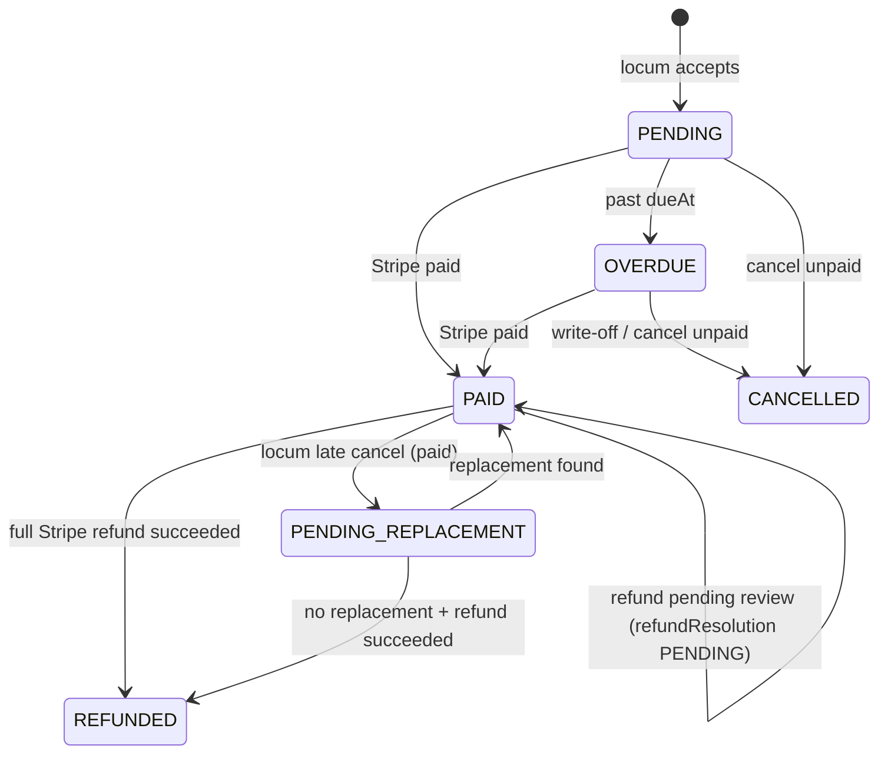
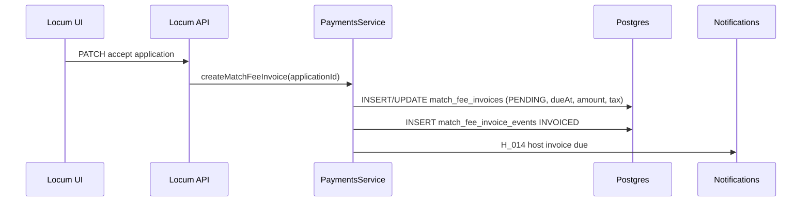
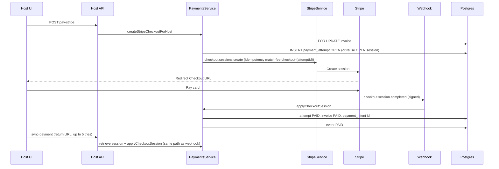
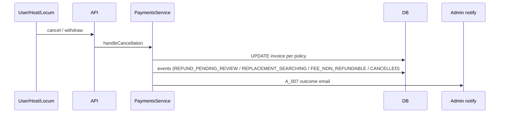
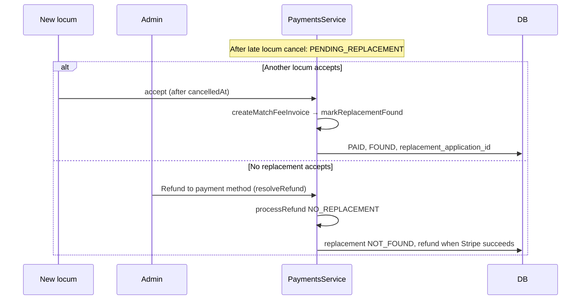

# Match fee + HST — flows, data, Stripe, safety, manual tests

**Full narrative (data flow, security, reconciliation, refunds, code links):**  
[`MATCH_FEE_PAYMENT_FLOW_COMPLETE.md`](./MATCH_FEE_PAYMENT_FLOW_COMPLETE.md)

Scope: **host platform match fee only** (CA$5 / CA$10 + 14% HST - TEMP staging live QA; production rates were CA$125 / CA$250). Not locum clinical pay or Stripe Connect.

---

## 1. Core entities (database)

| Table | Purpose |
|-------|---------|
| `match_fee_invoices` | One row per application cycle (`PRIMARY`); optional `TIER_TOP_UP` for half→full delta after placement; amount, tax, status, due, Stripe IDs, `refundedCents`, replacement fields |
| `match_fee_payment_attempts` | One row per Checkout session started |
| `match_fee_refunds` | Admin-initiated refunds (reservation + Stripe state) |
| `match_fee_invoice_events` | Audit timeline |
| `stripe_webhook_events` | Idempotent webhook processing (`PROCESSING` → `PROCESSED` / `FAILED`) |
| `host_profiles.stripe_customer_id` | Stripe Customer for Checkout |

---

## 2. Invoice lifecycle (status)



**Virtual UI:** `Refund in progress` = admin review pending **or** Stripe refund `REQUESTED`/`PENDING`.  
**Virtual UI:** `Fee retained` = `PAID` + `FEE_NON_REFUNDABLE` event (late host cancel).

---

## 3. Flow A — Invoice creation (locum accept)



**Data written:** `match_fee_invoices` (tier $5/$10 TEMP, `tax_cents`, `due_at` = min(7d, shift start)), `events`.

**Replacement shortcut:** If posting already has `PENDING_REPLACEMENT` and accept is **after** `cancelledAt` → `markReplacementFound` (no second invoice).

**Post-placement tier top-up:** When a posting becomes `COMPLETED` (hourly sync + daily safety net), if a confirmed locum’s live claimed hours are **full-day** but the PRIMARY invoice was **half-day**: unpaid PRIMARY → bump to full-day + notify host; paid PRIMARY → create `TIER_TOP_UP` for the fee delta (+ HST) + notify host (one top-up per application).

---

## 4. Flow B — Host pay (Stripe Checkout)



**Cron (every 10 min):** `reconcileOpenCheckoutSessions` — sessions older than 2 min, `OPEN` → ask Stripe → apply paid/expired.  
**Orphans:** OPEN with no session id > 15 min → `FAILED`.

**Duplicate pay:** Second completed session while invoice not payable → attempt `DUPLICATE`, admin alert (money held, not applied).

---

## 5. Flow C — Cancellation policy (no automatic Stripe refund)

| Actor | ≥14 days before start | &lt;14 days before start |
|-------|----------------------|---------------------------|
| Host | Paid → `PAID` + `refundResolution PENDING` + admin review | Paid → stay `PAID`, `FEE_NON_REFUNDABLE` |
| Locum | Same refund review | Paid → `PENDING_REPLACEMENT` + `SEARCHING` (fee refundable if no replacement accepts) |
| Either | Unpaid → `CANCELLED` | Unpaid → stays `PENDING`/`OVERDUE` (remains due) |

**Tier top-up:** Post-placement `TIER_TOP_UP` invoices follow the same pay / cancel / refund rules as the primary match fee.

**Triggers:** locum withdraw, host cancel match (applicants UI), job delete, admin.



---

## 6. Flow D — Admin refund to card

```mermaid
sequenceDiagram
  participant A as Admin UI
  participant API
  participant PS as PaymentsService
  participant ST as Stripe
  participant WH as Webhook
  participant DB

  A->>API: resolve-refund / discretionary / no-replacement
  API->>PS: processRefund
  PS->>DB: FOR UPDATE invoice
  PS->>DB: block if refund REQUESTED or PENDING
  PS->>DB: INSERT refund REQUESTED, increment refundedCents
  PS->>ST: refunds.create (idempotency match-fee-refund-{refundId})
  alt succeeded
    PS->>DB: refund SUCCEEDED, finalize invoice REFUNDED if full
    PS->>DB: event REFUNDED, notify host
  else pending
    PS->>DB: refund PENDING, invoice stays PAID (or PENDING_REPLACEMENT)
    Note over PS: No host refund email until succeeded
  else Stripe timeout
    PS->>DB: refund stays REQUESTED
    Note over PS: 503 to admin; reconcile retries
  end
  ST->>WH: refund.updated / refund.failed
  WH->>PS: applyStripeRefund → finalize or failRefund (release cents)
```

**Cron (every 10 min):** `reconcileRefunds` — `REQUESTED`/`PENDING` older than 2 min → retrieve or recreate refund → `applyStripeRefund`.

---

## 7. Flow E — Replacement



**Rule:** Replacement **FOUND** is set only when a real application accepts after cancel — not by admin buttons. Admin refunds if none accepts.

**Guard:** No refund while non-duplicate refund `REQUESTED`/`PENDING`.

---

## 8. Flow F — Overdue / escalation / reminders

| Step | Cron | DB / notify |
|------|------|-------------|
| Mark overdue | Daily 1am | `PENDING` → `OVERDUE`, event, H_016 |
| Recurring reminder | Daily 1am | Every 7d `last_reminder_at`, PAYMENT_REMINDER |
| Escalate | Daily 1am | 30d past due → `escalated_at`, host review flag, admin A_006 |
| Block new posts | On post | Host with `OVERDUE` invoice rejected |

---

## 9. Stripe webhook handling

**Endpoint:** `POST /api/payments/stripe/webhook` (raw body, `Stripe-Signature`).

| Event | Action |
|-------|--------|
| `checkout.session.completed` / `async_payment_succeeded` | `applyCheckoutSession` |
| `checkout.session.expired` | attempt EXPIRED |
| `checkout.session.async_payment_failed` | attempt FAILED |
| `payment_intent.payment_failed` | OPEN attempt failure reason |
| `refund.created` / `updated` / `failed` | `applyStripeRefund` |

**Webhook idempotency:** `stripe_webhook_events.id` = Stripe event id; stale `PROCESSING` > 5 min reclaim; concurrent → 409 (Stripe retries).

**Stripe retries:** If the endpoint does not return **2xx** (timeout, connection drop, 5xx, or our **409** while another worker holds the event), Stripe retries with backoff for up to **~3 days** in live mode. Invalid signature → **400** (no processing). Paid state is reconciled via webhooks, host **sync-payment**, and the **10 min** checkout reconcile job—not manual status edits.

**Ignored:** livemode mismatch with API key mode.

---

## 10. Safety measures (checklist)

| Area | Measure |
|------|---------|
| Authz | Host JWT + `hostProfileId` on all host invoice routes |
| Authz | Admin JWT on refund / write-off |
| Amounts | Checkout line items from DB invoice, not client |
| Pay confirm | Webhook verifies amount, currency, metadata, customer |
| Double pay | Conditional invoice `updateMany` PENDING/OVERDUE → PAID once; extras DUPLICATE |
| Concurrent checkout | Invoice `FOR UPDATE`; in-flight OPEN attempt without session |
| Webhook | HMAC signature + 5 min tolerance |
| Webhook replay | Event id table + PROCESSING reclaim rules |
| Refund cap | `FOR UPDATE` + `refundedCents` reservation before Stripe |
| Refund race | Block REQUESTED **and** PENDING non-duplicate refunds |
| Refund idempotency | Stripe key `match-fee-refund-{refundRowId}` |
| Refund truth | Host REFUNDED + email only after Stripe `succeeded` |
| Refund failure | `failRefund` decrements reservation, restores PENDING review if needed |
| Prod config | `STRIPE_SECRET_KEY` + `STRIPE_WEBHOOK_SECRET` required |
| PCI | Stripe Checkout only (SAQ A friendly) |
| Reconcile | 10 min checkout + refund safety net |
| Secrets | No card data stored |

---

## 11. Manual test cases

Use **Stripe test mode** (`sk_test_`, test cards `4242…`). Run backend + frontend + webhook forwarder (or rely on sync + reconcile).

### A. Invoice & policy

| # | Steps | Expected |
|---|--------|----------|
| A1 | Locum accepts confirmed match | Host gets invoice PENDING; event INVOICED; due date shown |
| A2 | Half-day vs full-day hours | $5 vs $10 + HST on invoice |
| A3 | Open Match Fees policy modal | Copy matches API policy |

### B. Pay

| # | Steps | Expected |
|---|--------|----------|
| B1 | Host Pay → complete Checkout | Return URL; sync → PAID; receipt PDF |
| B2 | Double-click Pay quickly | One Checkout URL reused or conflict (no two paid sessions) |
| B3 | Cancel Checkout | `cancelled=1` banner; invoice still Due/Overdue |
| B4 | Pay after webhook delay | sync-payment or wait 10 min reconcile → PAID |
| B5 | Wrong amount in Stripe (simulate bad webhook in test env) | attempt REJECTED; invoice not PAID; admin alert |

### C. Overdue

| # | Steps | Expected |
|---|--------|----------|
| C1 | Invoice past due (adjust clock or wait) | OVERDUE; cannot post new job |
| C2 | Pay overdue invoice | → PAID; post allowed |
| C3 | Admin write-off | → CANCELLED; note on timeline |
| C4 | Admin send reminder | PAYMENT_REMINDER event |

### D. Host cancel match

| # | Steps | Expected |
|---|--------|----------|
| D1 | Applicants → locum accepted → Cancel match (≥14d, paid) | Modal; refund pending review; admin REFUND_DUE |
| D2 | Same, &lt;14d paid | Confirm non-refundable; FEE_NON_REFUNDABLE; chip Fee retained |
| D3 | Unpaid cancel ≥14d | Invoice CANCELLED |
| D4 | Unpaid cancel &lt;14d | Invoice stays due (PENDING/OVERDUE) |

### E. Locum withdraw

| # | Steps | Expected |
|---|--------|----------|
| E1 | Withdraw ≥14d, host paid | Refund pending review |
| E2 | Withdraw &lt;14d, host paid | PENDING_REPLACEMENT; seeking replacement copy |
| E3 | Withdraw dialog copy | Early vs late explanation shown |

### F. Admin refund

| # | Steps | Expected |
|---|--------|----------|
| F1 | Approve policy refund (type Refund + note) | Stripe refund; PAID until succeeded → REFUNDED; host email on success |
| F2 | Double-click approve | Second request conflict |
| F3 | Approve while Stripe pending (test card delay) | Second approve blocked; invoice stays PAID |
| F4 | Stripe refund failed webhook | REFUND_FAILED; cents released; PAID + pending review restored |
| F5 | Discretionary $5/$10 post-completion | Partial/full per remaining |
| F6 | Duplicate payment row | Refund extra payment only |

### G. Replacement

| # | Steps | Expected |
|---|--------|----------|
| G1 | Late locum cancel → new locum accepts | Auto FOUND; no second invoice; replacement name on invoice |
| G2 | Late locum cancel → no accept → admin Refund to payment method | Refund starts; PENDING_REPLACEMENT → REFUNDED when Stripe succeeds |
| G3 | Click refund during pending Stripe refund | API conflict |

### H. Admin review tools

| # | Steps | Expected |
|---|--------|----------|
| H1 | Clear review flag | Host `matchFeeReviewRequired` cleared |

### I. Regression / ops

| # | Steps | Expected |
|---|--------|----------|
| I1 | Restart API without Stripe secrets in prod | Boot fails validation |
| I2 | Invalid webhook signature | 400; no DB change |
| I3 | Replay same webhook event id | Processed once |
| I4 | FAQ “Do I have to pay?” | Locum free; host match fee described |

---

## 12. Automated tests (reference)

- `backend/test/journeys/journey-stripe-payments.spec.ts` — checkout, webhooks, duplicates, refunds, reconcile, pending refund guard
- `backend/test/journeys/journey-match-fee.spec.ts` — tiering, pay path
- Unit: `match-fee-cancellation.util.spec.ts`, `match-fee.constants.spec.ts`

Run (requires test Postgres):

```bash
cd backend && npm run test:e2e:prepare
cd backend && npx jest --config ./test/jest-e2e.json --runInBand test/journeys/journey-stripe-payments.spec.ts
```

---

## 13. Key code paths

| Concern | File |
|---------|------|
| Core logic | `backend/src/payments/payments.service.ts` |
| Policy | `backend/src/payments/match-fee-cancellation.util.ts` |
| Stripe | `backend/src/payments/stripe.service.ts` |
| Webhooks | `backend/src/payments/stripe.webhook.controller.ts` |
| Cron | `backend/src/scheduler/scheduler.service.ts` |
| Host UI | `frontend/src/app/host/invoices/host-invoices-page.tsx` |
| Host cancel | `frontend/src/app/host/applicants/[jobId]/page-client.tsx` |
| Admin UI | `frontend/src/app/admin/payments/admin-payments-page.tsx` |
